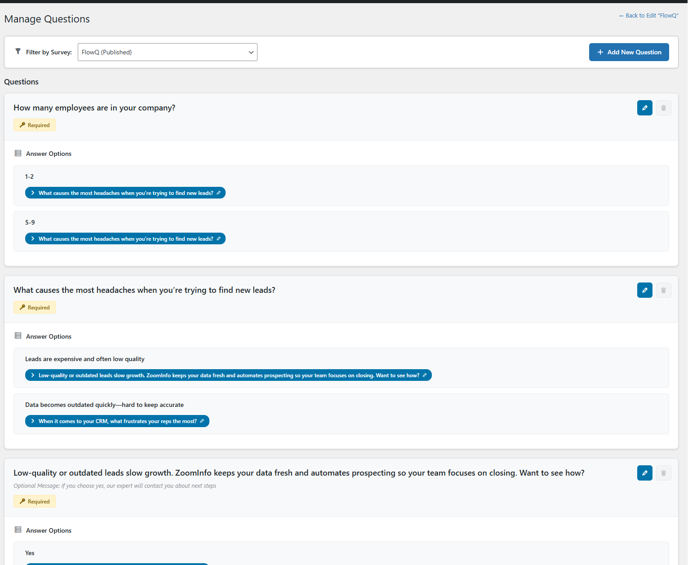
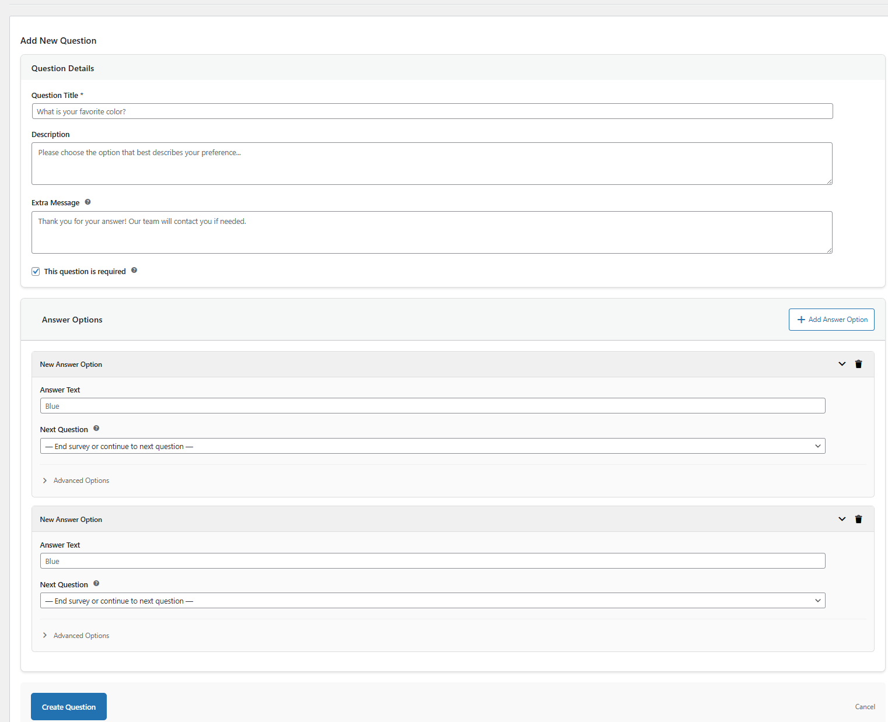
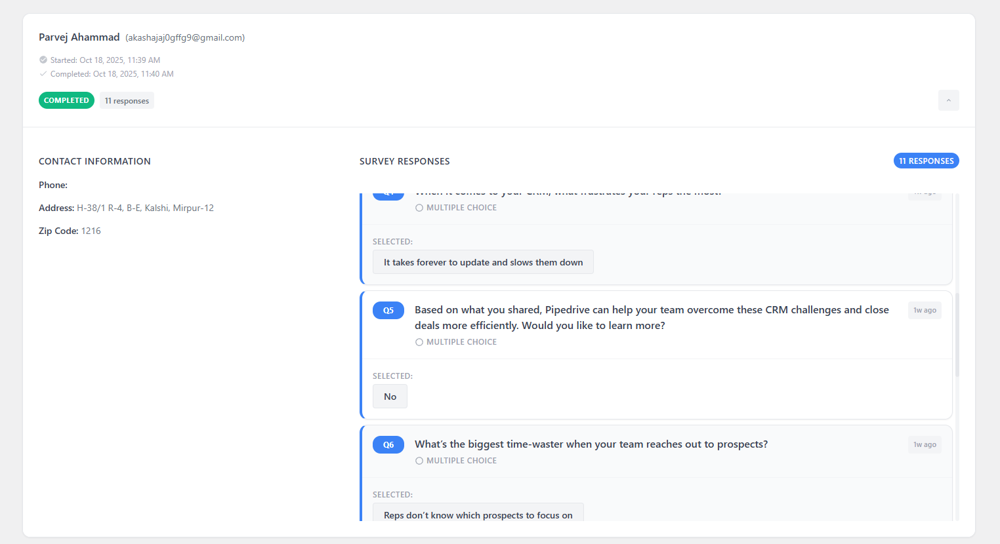
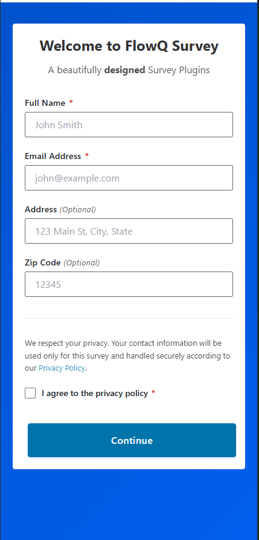

# FlowQ

**Create intelligent, dynamic surveys that adapt in real-time to user responses. Engage your audience with interactive question flows built right inside WordPress.**

[](https://wordpress.org/)
[](https://php.net/)
[](https://www.gnu.org/licenses/gpl-2.0.html)

---

## Table of Contents

- [Overview](#overview)
- [Key Features](#key-features)
- [Requirements](#requirements)
- [Installation](#installation)
- [Quick Start Guide](#quick-start-guide)
- [Usage](#usage)
  - [Creating Your First Survey](#creating-your-first-survey)
  - [Building Questions](#building-questions)
  - [Conditional Branching](#conditional-branching)
  - [Managing Participants](#managing-participants)
- [Settings & Configuration](#settings--configuration)
- [Template System](#template-system)
- [Shortcodes](#shortcodes)
- [Analytics & Reporting](#analytics--reporting)
- [Developer Documentation](#developer-documentation)
- [FAQ](#faq)
- [Changelog](#changelog)
- [Support](#support)
- [License](#license)

---

## Overview

FlowQ is a powerful WordPress plugin that revolutionizes how you collect data from your audience. Unlike traditional static surveys, FlowQ creates dynamic, interactive question flows that adapt based on user responses, providing a personalized experience that increases completion rates and engagement.

Perfect for:
- Market research and customer feedback
- Lead generation and qualification
- Product recommendation quizzes
- Educational assessments
- Event registration with conditional questions
- Customer satisfaction surveys

---

## Key Features

### 🎯 Dynamic Question Flow
- **Conditional Branching**: Route users to different questions based on their answers
- **Smart Navigation**: Create complex survey logic without any coding
- **External Redirects**: Send users to specific pages based on their responses
- **Skip Options**: Allow participants to skip questions when appropriate

### 🎨 Beautiful Templates
- **5 Pre-built Templates**: Classic, Modern, Card-based, Dark Mode, and Colorful
- **Customizable Styling**: Adjust colors, fonts, and button styles
- **Responsive Design**: Perfect on desktop, tablet, and mobile devices
- **Template-aware Forms**: Participant forms automatically match your selected template

### 📊 Participant Management
- **Two-Stage Forms**: Collect basic info first, then phone number (configurable)
- **Single-Stage Option**: All fields in one simple form
- **Email Validation**: Prevent duplicate submissions (optional)
- **Field Visibility Controls**: Show/hide address, zipcode, and phone fields
- **International Support**: Accepts various zip/postal code formats

### 🔒 Privacy & Security
- **Privacy Policy Integration**: Display custom privacy policies with required checkboxes
- **Rich Text Support**: Format privacy policies with links and formatting
- **Secure Data Handling**: WordPress security best practices built-in
- **GDPR Ready**: Tools to manage participant data responsibly

### 📈 Analytics & Tracking
- **Response Tracking**: Monitor all survey responses in real-time
- **Participant Insights**: View detailed participant information
- **Session Management**: Track user sessions and completion rates
- **Question Analytics**: See which questions get the most responses

### ⚡ Easy Integration
- **Simple Shortcodes**: Embed surveys anywhere with `[dynamic_survey id="X"]`
- **Page Builder Compatible**: Works with popular page builders
- **Thank You Pages**: Redirect to custom thank you pages after completion
- **REST API**: Extend functionality with custom integrations

---

## Requirements

- **WordPress**: 5.0 or higher
- **PHP**: 7.4 or higher
- **MySQL**: 5.6 or higher (or MariaDB 10.0+)
- **Browser**: Modern browser with JavaScript enabled

---

## Installation

### Method 1: WordPress Admin (Recommended)

1. Download the FlowQ plugin ZIP file
2. Log in to your WordPress admin dashboard
3. Navigate to **Plugins > Add New**
4. Click **Upload Plugin** at the top
5. Choose the ZIP file and click **Install Now**
6. Click **Activate Plugin** after installation

### Method 2: Manual Installation

1. Download and unzip the FlowQ plugin
2. Upload the `flowq` folder to `/wp-content/plugins/`
3. Activate the plugin through the **Plugins** menu in WordPress

### Method 3: FTP Upload

1. Unzip the downloaded plugin file
2. Connect to your server via FTP
3. Upload the `flowq` folder to `/wp-content/plugins/`
4. Navigate to **Plugins** in WordPress admin and activate FlowQ

### Post-Installation

After activation, FlowQ will:
- Create necessary database tables
- Set default configuration options
- Seed 5 beautiful templates
- Create upload directories for survey data

You'll find a new **FlowQ** menu item in your WordPress admin sidebar.

---

## Quick Start Guide

### 1. Create Your First Survey (2 minutes)

1. Go to **FlowQ > Add New Survey**
2. Enter a survey title (e.g., "Customer Satisfaction Survey")
3. Optionally add a form header and subtitle (supports rich text)
4. Select a thank you page from the dropdown
5. Click **Create Survey**

### 2. Add Questions (5 minutes)

1. Click **Manage Questions** on your survey card
2. Click **Add New Question**
3. Enter your question title
4. Add answer options (e.g., "Very Satisfied", "Satisfied", "Neutral")
5. Optionally set up conditional branching for each answer
6. Click **Save Question**
7. Repeat for additional questions

### 3. Embed Your Survey (1 minute)

1. Return to **All Surveys**
2. Copy the shortcode from your survey card (e.g., `[dynamic_survey id="1"]`)
3. Paste it into any page, post, or widget
4. Publish and test!

**That's it!** Your dynamic survey is now live and ready to collect responses.

---

## Usage

### Creating Your First Survey

#### Basic Survey Setup

Navigate to **FlowQ > Add New Survey** and fill in:

- **Survey Title**: Internal name for your survey (e.g., "Q1 2024 Customer Survey")
- **Form Header**: Large heading shown to participants (supports rich text)
- **Form Subtitle**: Descriptive text below the header (supports bold, italic, links, lists)
- **Thank You Page**: WordPress page to redirect users after completion (pages with "thank you" in the name are starred)
- **Status**: Published or Draft

**Pro Tip**: Use the rich text editor in the subtitle to add formatted instructions, links to privacy policies, or estimated completion time.

### Building Questions

#### Creating Questions

1. From **All Surveys**, click **Manage Questions** on your survey
2. Click **Add New Question**
3. Fill in the question details:
   - **Question Title**: The main question text
   - **Description**: Optional explanatory text
   - **Extra Message**: Additional context or instructions
   - **Allow Skip**: Let users skip this question

#### Adding Answer Options

For each question, add multiple answer choices:

1. Click **Add Answer Option**
2. Enter **Answer Text**: What the user sees (e.g., "Very Satisfied")
3. Enter **Answer Value**: Internal value for tracking (e.g., "5")
4. Optionally configure:
   - **Next Question**: Which question to show next if this answer is selected
   - **Redirect URL**: External URL to send user to if this answer is selected
5. Reorder answers by dragging them up or down

**Answer Order**: Users see answers in the order you specify (use drag handles to reorder).

### Conditional Branching

FlowQ's powerful branching system lets you create dynamic survey flows:

#### Example: Product Recommendation Survey

**Question 1**: "What type of product are you looking for?"
- Answer: "Software" → Next Question: Q2 (Software-specific questions)
- Answer: "Hardware" → Next Question: Q5 (Hardware-specific questions)
- Answer: "Services" → Redirect URL: https://yoursite.com/services

**Question 2**: "What's your budget range?"
- Answer: "Under $100" → Next Question: Q3
- Answer: "$100-$500" → Next Question: Q4
- Answer: "Over $500" → Redirect URL: https://yoursite.com/enterprise

This creates a personalized path for each user based on their responses.

#### Best Practices for Branching

- **Plan Your Flow**: Sketch out the question tree before building
- **Test All Paths**: Make sure every answer leads somewhere logical
- **Avoid Dead Ends**: Always provide a next step or redirect
- **Use Skip Wisely**: Only allow skips on truly optional questions

### Managing Participants

#### Viewing Participant Data

Navigate to **FlowQ > Analytics** to see:

- Total participants
- Total sessions (including incomplete)
- Total responses across all questions
- Individual participant details (name, email, phone, address, zipcode)
- Submission timestamps

#### Exporting Data

Currently, participant data is viewable in the WordPress admin. Future versions will include CSV export functionality.

#### Privacy Considerations

- Participant data is stored securely in your WordPress database
- Only administrators can access participant information
- Consider adding a privacy policy link in your survey subtitle
- Use the privacy policy checkbox feature to ensure compliance

---

## Settings & Configuration

Access global settings at **FlowQ > Settings**.

### General Settings Tab

#### Form Configuration

**Two-Stage Form**
- **Enabled**: Stage 1 collects name, email, address, zipcode. Stage 2 collects phone number.
- **Disabled**: All fields appear on a single form
- Automatically disabled if phone field is hidden

**Allow Duplicate Email Submissions**
- **Disabled** (default): Each email can only submit once per survey
- **Enabled**: Same email can submit multiple times

**Optional Phone Number in Stage 2**
- Only available when two-stage form is enabled
- Allows users to skip phone number entry
- Currently in development

#### Field Visibility

Control which participant fields are shown:

- **Name**: Always required (cannot be hidden)
- **Email**: Always required (cannot be hidden)
- **Address**: Optional field (default: visible)
- **Zipcode**: Optional field (default: visible)
- **Phone**: Optional field (default: visible)

**Note**: Hiding the phone field automatically disables two-stage forms.

#### Privacy Policy Settings

**Single-Stage Privacy Policy**
- Shown when two-stage form is disabled
- Supports rich HTML formatting
- Required checkbox before survey submission

**Two-Stage Privacy Policies**
- **Stage 1 Policy**: Shown before participant info submission
- **Stage 2 Policy**: Shown before phone number submission
- Each can have different content

**Customization Tips**:
- Use the WordPress editor to format your privacy policy
- Add links to your site's privacy policy page
- Keep it concise but legally compliant
- Update regularly to match your privacy practices

### Templates Tab

Choose from 5 professionally designed templates:

1. **Classic**: Traditional form-style design with clean lines
2. **Modern**: Minimalist design with ample whitespace
3. **Card-based**: Elevated card layout with subtle shadows
4. **Dark Mode**: Dark theme with white text and dark input fields
5. **Colorful**: Vibrant gradient design with bold colors

**Template Features**:
- Preview before selecting
- One-click activation
- Applies globally to all surveys
- Customizable colors and styles (coming soon)

**Active Template**: Shows a green badge on the currently active template.

---

## Template System

### How Templates Work

Templates control the visual appearance of:
- Participant information forms
- Question containers
- Answer options
- Submit buttons
- Privacy policy sections

### Template Customization

Each template supports:
- **Primary Color**: Main accent color for buttons and highlights
- **Background Color**: Overall background color
- **Text Color**: Main text color
- **Input Styling**: Background, border, and text colors for form fields
- **Button Styles**: Solid, gradient, or elevated button designs
- **Border Radius**: Control rounded corners
- **Font Family**: Choose your preferred font

### Creating Custom Templates (Advanced)

Templates are stored in the `flowq_templates` database table with JSON-formatted styles. Advanced users can create custom templates by:

1. Duplicating an existing template in the database
2. Modifying the JSON styles
3. Adding a custom preview image to `assets/images/templates/`
4. Activating via the Templates tab

**Developer Note**: Future versions will include a visual template builder.

---

## Shortcodes

### Basic Shortcode

```
[dynamic_survey id="1"]
```

Displays the survey with ID 1.

### Finding Your Survey ID

1. Go to **FlowQ > All Surveys**
2. Find the survey you want to embed
3. Copy the shortcode shown on the survey card
4. Paste it into any page, post, or widget

### Shortcode Parameters

Currently supported:
- `id`: Survey ID (required)

**Example Usage**:

```
[dynamic_survey id="1"]
```

### Embedding in Templates

For theme developers, you can use the shortcode in PHP:

```php
<?php echo do_shortcode('[dynamic_survey id="1"]'); ?>
```

### Page Builder Compatibility

FlowQ shortcodes work with:
- Gutenberg (Block Editor): Use the Shortcode block
- Classic Editor: Paste shortcode directly
- Elementor: Use the Shortcode widget
- Beaver Builder: Use the Shortcode module
- Divi: Use the Shortcode module
- WPBakery: Use the Shortcode element

---

## Analytics & Reporting

### Accessing Analytics

Navigate to **FlowQ > Analytics** to view survey performance.

### Available Metrics

**Survey-Level Statistics**:
- Total participants (completed surveys)
- Total sessions (including incomplete)
- Total responses across all questions
- Average completion rate (coming soon)

**Question-Level Analytics**:
- Number of responses per question
- Answer distribution (coming soon)
- Drop-off points (coming soon)

**Participant Details**:
- Name
- Email address
- Phone number (if provided)
- Address and zipcode (if provided)
- Submission date and time
- Survey responses

### Future Analytics Features

Planned for upcoming releases:
- CSV/Excel export of all data
- Visual charts and graphs
- Answer distribution percentages
- Completion funnel analysis
- Time-to-complete metrics
- Response trends over time

---

## Developer Documentation

### Database Schema

FlowQ creates the following tables (with `wp_` prefix):

- `flowq_surveys`: Survey definitions
- `flowq_questions`: Question data
- `flowq_answers`: Answer options
- `flowq_responses`: User responses
- `flowq_participants`: Participant information
- `flowq_sessions`: Session tracking
- `flowq_templates`: Template definitions

### Hooks & Filters

#### Actions

```php
// Before survey is displayed
do_action('flowq_before_survey', $survey_id);

// After survey is displayed
do_action('flowq_after_survey', $survey_id);

// After participant is created
do_action('flowq_participant_created', $participant_id, $survey_id);

// After response is saved
do_action('flowq_response_saved', $response_id, $question_id, $participant_id);
```

#### Filters

```php
// Modify survey data before display
apply_filters('flowq_survey_data', $survey_data, $survey_id);

// Modify question data
apply_filters('flowq_question_data', $question_data, $question_id);

// Modify template styles
apply_filters('flowq_template_styles', $styles, $template_id);

// Customize privacy policy text
apply_filters('flowq_privacy_policy', $policy_text, $stage);
```

### REST API Endpoints

FlowQ includes REST API support (coming soon):

- `GET /wp-json/flowq/v1/surveys` - List all surveys
- `GET /wp-json/flowq/v1/surveys/{id}` - Get single survey
- `POST /wp-json/flowq/v1/responses` - Submit response
- `GET /wp-json/flowq/v1/analytics/{id}` - Get survey analytics

### Class Reference

#### Core Classes

- `flowq_Plugin`: Main plugin class
- `flowq_Manager`: Survey CRUD operations
- `flowq_Question_Manager`: Question management
- `flowq_Participant_Manager`: Participant handling
- `flowq_Session_Manager`: Session tracking
- `flowq_Template_Handler`: Template system

#### Admin Classes

- `flowq_Admin`: Admin interface
- `flowq_Question_Admin`: Question builder UI
- `flowq_Settings_Admin`: Settings page
- `flowq_Shortcode_Builder`: Shortcode generator

#### Frontend Classes

- `flowq_Frontend`: Frontend display
- `flowq_Shortcode`: Shortcode handler
- `flowq_Ajax_Handler`: AJAX request handling

### Extending FlowQ

#### Custom Question Types

Future versions will support custom question types. Current version uses `single_choice` type only.

#### Custom Templates

Add custom templates programmatically:

```php
add_action('init', function() {
    global $wpdb;
    $table = $wpdb->prefix . 'flowq_templates';

    $wpdb->insert($table, [
        'name' => 'Custom Template',
        'description' => 'My custom template',
        'is_default' => 0,
        'preview_image' => 'path/to/preview.svg',
        'styles' => json_encode([
            'primary_color' => '#007cba',
            'background_color' => '#ffffff',
            'text_color' => '#333333'
        ])
    ]);
});
```

---

## FAQ

### General Questions

**Q: Is FlowQ free?**
A: Yes, FlowQ is released under GPL v2 license and is completely free to use.

**Q: How many surveys can I create?**
A: Unlimited! Create as many surveys as you need.

**Q: Does it work with my theme?**
A: Yes, FlowQ is designed to work with any properly coded WordPress theme.

**Q: Can I translate FlowQ?**
A: Yes, FlowQ is translation-ready with text domain `flowq`.

### Technical Questions

**Q: What happens to data if I deactivate the plugin?**
A: Data is preserved. Only uninstalling the plugin will remove database tables.

**Q: Can I export survey responses?**
A: CSV export is planned for a future release. Currently, data is viewable in WordPress admin.

**Q: Does it work with page builders?**
A: Yes, FlowQ shortcodes work with all major page builders.

**Q: Is it GDPR compliant?**
A: FlowQ provides tools for GDPR compliance (privacy policies, data viewing), but you're responsible for your site's overall compliance.

### Troubleshooting

**Q: Survey not displaying on frontend**
A: Check that:
- Survey status is "Published"
- You're using the correct shortcode
- JavaScript is enabled in browser
- No theme/plugin conflicts (disable other plugins to test)

**Q: Answers not saving**
A: Verify that:
- WordPress database is writable
- No JavaScript errors in browser console
- Session cookies are enabled

**Q: Styling looks broken**
A: Try:
- Clearing browser cache
- Checking for CSS conflicts with your theme
- Switching to a different FlowQ template
- Deactivating other plugins temporarily

**Q: Email validation not working**
A: Ensure:
- "Allow Duplicate Email Submissions" is disabled in Settings
- You're testing with different email addresses
- Browser cache is cleared

---

## Changelog

### Version 1.0.0 (2024)

#### Initial Release

**Core Features**:
- Survey creation and management
- Question builder with single-choice questions
- Answer options with conditional branching
- External redirect support
- Skip question functionality
- Participant form (two-stage and single-stage)
- Session management and tracking
- Shortcode system for embedding surveys

**Templates**:
- 5 pre-built templates (Classic, Modern, Card-based, Dark Mode, Colorful)
- Template selection UI
- Dynamic CSS generation
- Template-aware participant forms

**Settings System**:
- General settings tab
- Field visibility controls
- Two-stage form toggle
- Email duplication prevention
- Privacy policy management (rich HTML support)
- Templates tab for template selection

**Admin Interface**:
- Survey list with 2-column grid layout
- Enhanced survey cards showing form header, shortcode, thank you page
- Question count statistics
- Rich text editor for survey subtitle
- Thank you page dropdown with star marking
- Question builder with AJAX operations
- Answer reordering with drag-and-drop
- Analytics dashboard
- Participant tracking

**Frontend**:
- Responsive survey display
- AJAX-powered navigation
- Progress tracking
- Thank you page redirects
- Privacy policy checkboxes with validation
- International zip/postal code support (4-10 characters)
- Template-based styling

**Developer Features**:
- REST API foundation
- Centralized AJAX handling
- Database migration system
- WordPress coding standards compliance
- Hooks and filters (coming soon)
- Translation-ready

#### Database Optimizations:
- Fixed N+1 query problem with question counts
- LEFT JOIN queries for efficient data fetching
- Indexed tables for better performance

#### Security:
- Nonce verification on all AJAX requests
- Capability checks for admin operations
- SQL injection prevention with prepared statements
- XSS protection with proper escaping
- CSRF protection

---

## Support

### Getting Help

**Documentation**: This README and the inline code documentation

**GitHub Issues**: Report bugs and request features at [GitHub Issues](https://github.com/dev-parvej/FlowQ/issues)

**Community Support**: WordPress.org support forums (coming soon)

### Reporting Bugs

When reporting bugs, please include:
1. WordPress version
2. PHP version
3. Active theme and plugins
4. Steps to reproduce the issue
5. Expected vs. actual behavior
6. Screenshots or error messages

### Feature Requests

We welcome feature requests! Please submit them via GitHub Issues with:
1. Clear description of the feature
2. Use case or problem it solves
3. Any relevant examples or mockups

---

## Contributing

We welcome contributions from the community!

### How to Contribute

1. Fork the repository
2. Create a feature branch (`git checkout -b feature/amazing-feature`)
3. Commit your changes (`git commit -m 'Add amazing feature'`)
4. Push to the branch (`git push origin feature/amazing-feature`)
5. Open a Pull Request

### Coding Standards

- Follow WordPress Coding Standards
- Comment your code thoroughly
- Test all changes before submitting
- Update documentation as needed

### Areas for Contribution

- Additional question types (multiple choice, text input, rating scales)
- Advanced analytics and reporting
- CSV/Excel export functionality
- Email notifications
- Integration with marketing platforms
- Additional templates
- Performance optimizations
- Bug fixes

---

## Roadmap

### Planned Features

**v1.1** (Coming Soon):
- Multiple question types (multiple choice, text input, rating scales)
- CSV/Excel export
- Question duplication across surveys
- Bulk question operations

**v1.2** (Future):
- Advanced analytics with charts
- Email notifications to admins
- Auto-responder emails to participants
- Question logic conditions (show/hide based on answers)

**v1.3** (Future):
- Integration with popular email marketing platforms
- Webhook support
- Custom CSS editor for templates
- Visual template builder

**v2.0** (Long-term):
- Multi-page surveys
- Save and resume functionality
- Question randomization
- A/B testing for questions
- Survey cloning
- Team collaboration features

---

## Credits

**Developed by**: Your Name

**Contributors**: Community contributors welcome!

**Libraries & Resources**:
- WordPress Core
- jQuery
- TinyMCE (Rich text editor)

---

## License

FlowQ is licensed under the **GNU General Public License v2 or later**.

```
This program is free software; you can redistribute it and/or modify
it under the terms of the GNU General Public License as published by
the Free Software Foundation; either version 2 of the License, or
(at your option) any later version.

This program is distributed in the hope that it will be useful,
but WITHOUT ANY WARRANTY; without even the implied warranty of
MERCHANTABILITY or FITNESS FOR A PARTICULAR PURPOSE. See the
GNU General Public License for more details.

You should have received a copy of the GNU General Public License
along with this program; if not, write to the Free Software
Foundation, Inc., 51 Franklin St, Fifth Floor, Boston, MA 02110-1301 USA
```

**Full License**: [https://www.gnu.org/licenses/gpl-2.0.html](https://www.gnu.org/licenses/gpl-2.0.html)

---

## Screenshots

### 1. Survey List Dashboard
View all your surveys in a clean 2-column grid with statistics and quick actions.


### 2. Create Survey
Comprehensive survey creation interface with custom headers, subtitles, and thank you page selection.


### 3. Question Builder
Intuitive interface for creating questions with conditional branching and answer options.



### 4. Question Management
Create and edit questions with multiple answer options and conditional logic.




### 5. Shortcode Display
Easy-to-copy shortcode for embedding surveys anywhere on your site.


### 6. Participant Tracking
View detailed participant information and track survey submissions.




### 7. Frontend Survey Display
Responsive, beautiful surveys that adapt to any device and theme.




### 8. Mobile Responsive Design
Fully responsive survey questions optimized for mobile devices.


---

**Made with ❤️ for the WordPress community**

**FlowQ** - Create intelligent, dynamic surveys that adapt in real-time to user responses.
