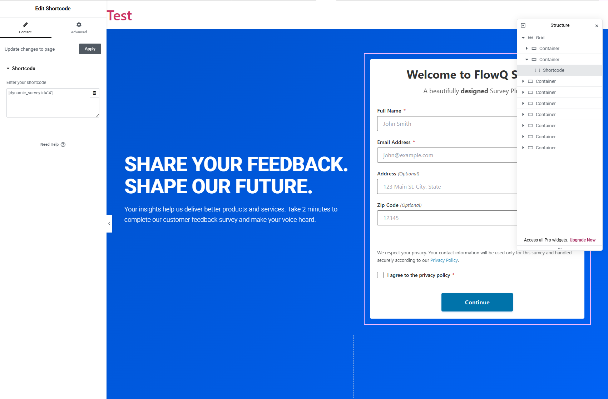
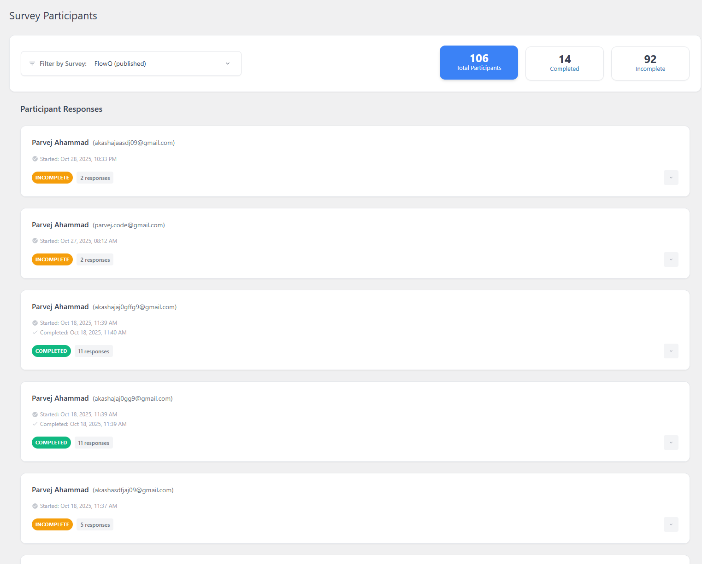

# FlowQ - Complete User Guide

**Welcome to FlowQ!** This comprehensive guide will walk you through every feature of FlowQ, from installation to creating your first dynamic survey. Whether you're a beginner or an experienced WordPress user, this guide will help you get the most out of FlowQ.

---

## Table of Contents

1. [Introduction](#introduction)
2. [Installation](#installation)
3. [Getting Started](#getting-started)
4. [Creating Your First Survey](#creating-your-first-survey)
5. [Building Questions](#building-questions)
6. [Understanding Conditional Logic](#understanding-conditional-logic)
7. [Embedding Surveys](#embedding-surveys)
8. [Configuring Settings](#configuring-settings)
9. [Managing Templates](#managing-templates)
10. [Viewing Analytics](#viewing-analytics)
11. [Best Practices](#best-practices)
12. [Troubleshooting](#troubleshooting)
13. [FAQ](#faq)

---

## Introduction

### What is FlowQ?

FlowQ is a powerful WordPress plugin that enables you to create **dynamic, intelligent surveys** that adapt based on user responses. Unlike traditional static surveys, FlowQ creates personalized experiences for each participant by showing different questions based on their previous answers.

### Key Benefits

- **Increase Completion Rates**: Show only relevant questions to each participant
- **Gather Better Data**: Personalized paths lead to more accurate responses
- **Save Time**: No coding required - visual builder makes it easy
- **Professional Design**: 5 beautiful templates included
- **Mobile Responsive**: Works perfectly on all devices
- **Privacy Focused**: GDPR-ready with built-in privacy policy support

### Who Should Use FlowQ?

- **Marketers**: Lead generation and qualification
- **Researchers**: Market research and customer feedback
- **Educators**: Assessments and learning evaluations
- **Product Managers**: User preference surveys and product recommendations
- **HR Professionals**: Employee satisfaction and recruitment surveys
- **Event Organizers**: Registration forms with conditional questions

---

## Installation

### System Requirements

Before installing FlowQ, ensure your system meets these requirements:

- **WordPress**: Version 5.0 or higher
- **PHP**: Version 7.4 or higher
- **MySQL**: Version 5.6 or higher (or MariaDB 10.0+)
- **Browser**: Modern browser with JavaScript enabled

### Installation Methods

#### Method 1: WordPress Admin Dashboard (Recommended)

1. **Download FlowQ**
   - Download the FlowQ plugin ZIP file from your source

2. **Upload to WordPress**
   - Log in to your WordPress admin dashboard
   - Navigate to **Plugins > Add New**
   - Click **Upload Plugin** at the top of the page
   - Click **Choose File** and select the FlowQ ZIP file
   - Click **Install Now**

3. **Activate the Plugin**
   - After installation completes, click **Activate Plugin**
   - You'll see a success message confirming activation

4. **Verify Installation**
   - Look for **FlowQ** in your admin sidebar
   - The plugin will automatically create necessary database tables
   - 5 default templates will be seeded

#### Method 2: Manual FTP Upload

1. **Extract the ZIP File**
   - Unzip the FlowQ plugin file on your computer
   - You should see a folder named `flowq`

2. **Upload via FTP**
   - Connect to your server using an FTP client (FileZilla, Cyberduck, etc.)
   - Navigate to `/wp-content/plugins/`
   - Upload the `flowq` folder

3. **Activate**
   - Go to WordPress admin **Plugins** page
   - Find FlowQ in the list
   - Click **Activate**

### Post-Installation Setup

After activation, FlowQ automatically:

✅ Creates 7 database tables for surveys, questions, answers, responses, participants, sessions, and templates
✅ Seeds 5 professional templates (Classic, Modern, Card-based, Dark Mode, Colorful)
✅ Sets default configuration options
✅ Creates upload directories for survey data

**You're now ready to create your first survey!**

---

## Getting Started

### Accessing FlowQ

After activation, you'll find **FlowQ** in your WordPress admin sidebar with the following menu items:

- **All Surveys**: View and manage all surveys
- **Add New Survey**: Create a new survey
- **Analytics**: View survey performance and participant data
- **Settings**: Configure global plugin settings

### Understanding the Dashboard

When you click **FlowQ > All Surveys**, you'll see:


**Dashboard Elements:**

1. **Add New Survey Button**: Quick access to create surveys
2. **Survey Cards**: 2-column grid showing all surveys
3. **Survey Statistics**: Questions, participants, completion rate
4. **Quick Actions**: Edit, Manage Questions, Analytics buttons
5. **Survey Details**: Form header, shortcode, thank you page

---

## Creating Your First Survey

Let's walk through creating a complete survey step-by-step.

### Step 1: Navigate to Add New Survey

1. Click **FlowQ > Add New Survey** in your admin sidebar
2. You'll see the survey creation form


### Step 2: Fill in Survey Details

#### Survey Title (Required)
- **What it is**: Internal name for your survey (not shown to participants)
- **Example**: "Q1 2024 Customer Satisfaction Survey"
- **Best Practice**: Use descriptive names with dates for easy organization

#### Survey Description (Optional)
- **What it is**: Internal notes about the survey purpose
- **Example**: "Measuring customer satisfaction with our new product launch"
- **Best Practice**: Document the survey goal for future reference

### Step 3: Configure Display Settings

#### Show Custom Header and Subtitle
- **Toggle this ON** to display custom text at the top of the participant form
- This replaces the survey title with your custom header

#### Survey Form Header (Optional)
- **What it is**: Large heading shown to participants
- **Example**: "Help Us Improve Your Experience"
- **Character Limit**: 255 characters
- **Tip**: Keep it short and compelling

#### Survey Form Subtitle (Optional)
- **What it is**: Descriptive text below the header (supports rich formatting)
- **Features**: Bold, italic, underline, links, lists
- **Example**:
  ```
  Your feedback matters! This quick survey takes only 2 minutes.
  Your responses will help us deliver better products and services.
  ```
- **Best Practice**:
  - Include estimated completion time
  - Add a link to your privacy policy
  - Explain how data will be used

### Step 4: Configure Page Settings

#### Thank You Page
- **What it is**: WordPress page users see after completing the survey
- **How to Select**:
  1. Click the dropdown menu
  2. Pages with "Thank You" in the name are marked with ⭐
  3. Select your desired page
  4. Click **Edit Page** button to modify the page

- **Creating a Thank You Page**:
  1. Go to **Pages > Add New**
  2. Title: "Thank You for Your Feedback"
  3. Add content: "Thank you for completing our survey! Your feedback helps us improve."
  4. Publish the page
  5. Return to FlowQ and select it from the dropdown

#### Survey Status
- **Published**: Survey is live and can be displayed
- **Draft**: Survey is hidden and won't appear on the frontend

### Step 5: Create the Survey

1. Review all fields
2. Click **Create Survey** button
3. You'll be redirected to the All Surveys page
4. Your new survey appears in the grid

**🎉 Congratulations!** You've created your first survey. Now let's add questions.

---

## Building Questions

Questions are the heart of your survey. FlowQ makes it easy to create engaging questions with conditional logic.

### Accessing the Question Builder

1. Go to **FlowQ > All Surveys**
2. Find your survey card
3. Click the **Questions** button


### Creating Your First Question

#### Step 1: Click "Add New Question"

You'll see the question creation form.


#### Step 2: Fill in Question Details

**Question Title (Required)**
- **What it is**: The main question text shown to participants
- **Example**: "How satisfied are you with our product?"
- **Best Practices**:
  - Be clear and specific
  - Use simple language
  - Avoid leading questions
  - One concept per question

**Description (Optional)**
- **What it is**: Additional context displayed below the question
- **Example**: "Please rate your overall satisfaction on a scale of 1-5"
- **When to use**: Provide clarification or instructions

**Extra Message (Optional)**
- **What it is**: Additional information or help text
- **Example**: "Consider factors like quality, price, and customer service"
- **When to use**: Give participants guidance on how to answer

**Allow Skip**
- **What it is**: Checkbox that lets participants skip this question
- **When to enable**: For optional questions or sensitive topics
- **When to disable**: For required information

#### Step 3: Add Answer Options

Every question needs at least 2 answer options.

**Adding an Answer:**

1. Click **Add Answer Option**
2. Fill in the fields:

**Answer Text (Required)**
- What participants see as the option
- Example: "Very Satisfied"

**Answer Value (Optional)**
- Internal value for data analysis
- Example: "5" or "very_satisfied"
- If left blank, uses the answer text

**Next Question (Optional)**
- Where to go if this answer is selected
- Creates conditional branching (see next section)

**Redirect URL (Optional)**
- External URL to send users to if this answer is selected
- Example: "https://yoursite.com/premium-support"
- Use for routing to specific pages or external resources

#### Step 4: Reorder Answers

- **Drag and Drop**: Use the drag handles to reorder answers
- **Order Matters**: Participants see answers in the order you set
- **Best Practice**: Put most likely answers first

#### Step 5: Save the Question

1. Review all fields
2. Click **Save Question**
3. The question appears in the question list

### Adding Multiple Questions

Repeat the process to add more questions:

1. Click **Add New Question**
2. Fill in details
3. Add answer options
4. Save

**Tip**: Plan your question flow before building. Sketch it on paper or use a flowchart tool.

### Editing Questions


To edit an existing question:

1. Find the question in the list
2. Click the **Edit** button (pencil icon)
3. Make your changes
4. Click **Save Question**

### Deleting Questions

To delete a question:

1. Find the question in the list
2. Click the **Delete** button (trash icon)
3. Confirm the deletion
4. ⚠️ **Warning**: This action cannot be undone

### Duplicating Questions

To duplicate a question (creates a copy):

1. Find the question in the list
2. Click the **Duplicate** button
3. The duplicated question appears with "(Copy)" appended to the title
4. Edit the copy to customize it

---

## Understanding Conditional Logic

Conditional logic (also called "branching") is FlowQ's most powerful feature. It lets you show different questions based on previous answers.

### How Conditional Logic Works

**Traditional Survey:**
```
Question 1 → Question 2 → Question 3 → Done
```

**FlowQ Survey with Branching:**
```
Question 1
  ↓ If "Yes" → Question 2
  ↓ If "No"  → Question 5
  ↓ If "Maybe" → Question 8
```

### Setting Up Conditional Logic

#### Example 1: Simple Product Survey

**Question 1**: "Are you a current customer?"
- **Answer 1**: "Yes" → **Next Question**: Question 2 (Customer Satisfaction)
- **Answer 2**: "No" → **Next Question**: Question 5 (Why Haven't You Purchased?)

**Result**: Current customers get satisfaction questions, non-customers get interest questions.

#### Example 2: Lead Qualification

**Question 1**: "What's your company size?"
- **Answer 1**: "1-10 employees" → **Next Question**: Question 2 (Small Business Path)
- **Answer 2**: "11-50 employees" → **Next Question**: Question 6 (Mid-Market Path)
- **Answer 3**: "51+ employees" → **Redirect URL**: https://yoursite.com/enterprise

**Result**: Small businesses see budget-friendly options, enterprises get redirected to enterprise sales.

#### Example 3: Product Recommendation

**Question 1**: "What's your primary use case?"
- **Answer 1**: "Photography" → **Next Question**: Question 2 (Camera Options)
- **Answer 2**: "Video Production" → **Next Question**: Question 8 (Video Equipment)
- **Answer 3**: "Both" → **Next Question**: Question 15 (Hybrid Options)

**Result**: Personalized recommendations based on user needs.

### Best Practices for Branching

1. **Plan Your Flow First**
   - Sketch the question tree on paper
   - Identify key decision points
   - Map all possible paths

2. **Test Every Path**
   - Complete the survey multiple times
   - Select different answer combinations
   - Ensure no dead ends

3. **Keep It Simple**
   - Don't overcomplicate the flow
   - 3-5 branches per question maximum
   - Test with real users

4. **Provide Exit Points**
   - Use redirect URLs for final routing
   - Always have a "next step" for each answer
   - Don't leave users stranded

5. **Use Skip Wisely**
   - Enable skip on optional questions
   - Don't skip critical branching questions
   - Consider the impact on data completeness

### Redirect URLs vs. Next Questions

**Use Next Question when:**
- You want to stay within the survey
- You need to collect more data
- The flow continues naturally

**Use Redirect URL when:**
- You want to send users to external resources
- The survey concludes based on this answer
- You're routing to different landing pages

**Pro Tip**: You can use both! Set a Next Question as the default path, and only use Redirect URL for specific routing needs.

---

## Embedding Surveys

Once you've created questions, it's time to display your survey on your website.

### Getting the Shortcode

1. Go to **FlowQ > All Surveys**
2. Find your survey card
3. Look for the **Shortcode** field



Example: `[flowq_survey id="4"]`

### Embedding in Pages and Posts

#### Using the Block Editor (Gutenberg)

1. Edit or create a new page/post
2. Click the **(+)** button to add a block
3. Search for **Shortcode**
4. Select the **Shortcode** block
5. Paste your shortcode: `[flowq_survey id="4"]`
6. Click **Publish** or **Update**

#### Using the Classic Editor

1. Edit or create a new page/post
2. Paste the shortcode directly in the editor: `[flowq_survey id="4"]`
3. Click **Publish** or **Update**

### Embedding with Page Builders

#### Elementor

1. Open page in Elementor
2. Drag the **Shortcode** widget to your desired location
3. Paste the shortcode in the widget settings
4. Click **Update**

#### Beaver Builder

1. Open page in Beaver Builder
2. Add a **Shortcode** module
3. Paste the shortcode
4. Save changes

#### Divi

1. Open page in Divi Builder
2. Add a **Shortcode** module
3. Paste the shortcode
4. Save

#### WPBakery

1. Open page in WPBakery
2. Add a **Shortcode** element
3. Paste the shortcode
4. Update page

### Embedding in Widget Areas

1. Go to **Appearance > Widgets**
2. Add a **Shortcode** widget to your desired widget area
3. Paste the shortcode
4. Save

### Embedding in Template Files (PHP)

For theme developers:

```php
<?php echo do_shortcode('[flowq_survey id="4"]'); ?>
```

### Viewing Your Survey

1. Visit the page where you embedded the shortcode
2. You'll see the participant form first


3. Fill in the participant information
4. Questions will appear one at a time


5. After completion, users are redirected to the Thank You page

---

## Configuring Settings

FlowQ offers comprehensive global settings that apply to all surveys.

### Accessing Settings

Click **FlowQ > Settings** in your admin sidebar.

### General Settings Tab

The General tab controls form behavior and participant data collection.

#### Form Configuration

**Two-Stage Form**
- **Default**: Enabled
- **When Enabled**:
  - Stage 1: Name, Email, Address, Zipcode
  - Stage 2: Phone Number
  - Two separate forms with continue buttons
- **When Disabled**:
  - Single form with all fields
  - One submit button
- **When to Disable**: If you don't need phone numbers or want a simpler flow

**Allow Duplicate Email Submissions**
- **Default**: Disabled (recommended)
- **When Disabled**: Each email can only submit once per survey
- **When Enabled**: Same email can submit multiple times
- **Use Cases**:
  - Disable for: Contest entries, unique feedback collection
  - Enable for: Testing surveys, family surveys, public polls

**Optional Phone Number in Stage 2**
- **Default**: Disabled
- **When Enabled**: Participants can skip phone number entry
- **Only Available**: When two-stage form is enabled
- **Status**: Coming soon

#### Field Visibility

Control which participant fields are shown:

**Name**
- Always required (cannot be hidden)
- Used for participant identification

**Email**
- Always required (cannot be hidden)
- Used for duplicate prevention and communication

**Address**
- **Default**: Visible
- **Use Case**: Physical product surveys, local services

**Zipcode**
- **Default**: Visible
- **Format**: Supports 4-10 characters (international formats)
- **Use Case**: Geographic segmentation, shipping surveys

**Phone**
- **Default**: Visible
- **Impact**: Hiding phone automatically disables two-stage form
- **Use Case**: Follow-up calls, SMS notifications

**Tip**: Only show fields you'll actually use. Each additional field reduces completion rates.

#### Privacy Policy Settings

FlowQ includes built-in privacy policy support with rich HTML formatting.

**Single-Stage Privacy Policy**
- **When Shown**: Two-stage form is disabled
- **Format**: Rich HTML editor
- **Required**: Checkbox must be checked before submission

**Two-Stage Privacy Policies**
- **Stage 1 Policy**: Shown before participant info submission
- **Stage 2 Policy**: Shown before phone number submission
- **Customization**: Different policies for each stage

**Best Practices**:
- Include a link to your full privacy policy page
- Explain what data you collect and why
- Mention data retention period
- Include GDPR compliance information
- Keep it concise but legally compliant

**Example Privacy Policy Text**:
```html
We respect your privacy. Your contact information will be used only for this survey
and handled securely according to our <a href="/privacy-policy">Privacy Policy</a>.
All participant information is encrypted and stored safely.
```

### Saving Settings

1. Make your changes
2. Scroll to the bottom
3. Click **Save General Settings**
4. You'll see a success message

---

## Managing Templates

Templates control the visual appearance of your surveys.

### Accessing Templates

1. Click **FlowQ > Settings**
2. Click the **Templates** tab

### Available Templates

FlowQ includes 5 professionally designed templates:

1. **Classic**
   - Traditional form-style design
   - Clean lines and professional appearance
   - Best for: Corporate surveys, formal feedback

2. **Modern**
   - Minimalist design with ample whitespace
   - Contemporary styling
   - Best for: Tech products, startups, modern brands

3. **Card-based**
   - Elevated card layout with subtle shadows
   - Material design inspired
   - Best for: E-commerce, product surveys

4. **Dark Mode**
   - Dark theme with white text
   - Dark input fields and containers
   - Best for: Gaming, tech, evening users

5. **Colorful**
   - Vibrant gradient design
   - Bold colors and eye-catching
   - Best for: Creative industries, fun surveys, younger audiences

### Selecting a Template

1. View the template preview images
2. Read the description
3. Click **Activate** on your preferred template
4. The active template shows a green "Active" badge
5. All surveys immediately use the new template

### Template Customization (Coming Soon)

Future versions will include:
- Custom color pickers
- Font family selection
- Button style customization
- Border radius controls
- Visual template builder

---

## Viewing Analytics

Track survey performance and participant data in real-time.

### Accessing Analytics

1. Click **FlowQ > Analytics** in the sidebar, OR
2. From All Surveys, click the **Analytics** button on a survey card

### Survey-Level Statistics

**Available Metrics:**
- **Total Participants**: Completed surveys
- **Total Sessions**: Including incomplete attempts
- **Total Responses**: Across all questions
- **Completion Rate**: Percentage of completed surveys

### Participant Data



**What You Can View:**
- Full name
- Email address
- Phone number (if provided)
- Address and zipcode (if provided)
- Submission date and time


### Response Tracking

View all responses for each participant:
- Which questions they answered
- Their selected answers
- Response timestamps
- Survey completion status

### Future Analytics Features

Planned for upcoming releases:
- **CSV/Excel Export**: Download all data
- **Visual Charts**: Bar graphs, pie charts, trends
- **Answer Distribution**: See percentage breakdowns
- **Completion Funnel**: Identify drop-off points
- **Time Metrics**: Average completion time
- **Response Trends**: Track changes over time
- **Question Performance**: Which questions get skipped most

---

## Best Practices

### Survey Design

1. **Keep It Short**
   - Aim for 5-10 questions maximum
   - Use branching to reduce questions per path
   - Each additional question reduces completion rate by ~5%

2. **Start with Easy Questions**
   - Build momentum with simple questions first
   - Save sensitive questions for later
   - End with demographic data

3. **Write Clear Questions**
   - One concept per question
   - Avoid jargon and technical terms
   - Use simple, direct language
   - Test questions with real users

4. **Provide Balanced Answers**
   - Include a full range of options
   - Don't lead participants to specific answers
   - Consider adding "Other" or "Prefer not to say"

5. **Set Clear Expectations**
   - Show estimated completion time in subtitle
   - Explain how data will be used
   - Include progress indicators (coming soon)

### Participant Forms

1. **Only Collect Necessary Data**
   - Hide unused fields in Settings
   - Each field reduces completion rate
   - Consider privacy implications

2. **Write a Compelling Header**
   - Explain the value of completing the survey
   - Keep it benefit-focused
   - Example: "Help us improve your experience" not "Fill out this survey"

3. **Be Transparent About Privacy**
   - Use the privacy policy feature
   - Link to your full privacy policy
   - Explain data retention

### Conditional Branching

1. **Plan Before Building**
   - Map out the flow on paper
   - Identify key decision points
   - Test all paths

2. **Don't Overcomplicate**
   - 3-5 branches maximum per question
   - Keep paths straightforward
   - Test with real users

3. **Avoid Dead Ends**
   - Every answer should lead somewhere
   - Use redirect URLs for final routing
   - Provide thank you pages

### Template Selection

1. **Match Your Brand**
   - Choose colors that align with your brand
   - Consider your audience's preferences
   - Test on different devices

2. **Consider Context**
   - Dark Mode for evening users
   - Colorful for fun/creative surveys
   - Classic for formal surveys

3. **Mobile First**
   - All templates are responsive
   - Test on mobile devices
   - Ensure text is readable on small screens

### Analytics and Optimization

1. **Monitor Completion Rates**
   - Track where users drop off
   - Optimize problematic questions
   - A/B test different approaches

2. **Review Response Data**
   - Look for patterns
   - Identify unexpected answers
   - Use insights to improve products/services

3. **Iterate Based on Feedback**
   - Survey your surveyed users
   - Ask about the experience
   - Continuously improve

---

## Troubleshooting

### Survey Not Displaying

**Problem**: Shortcode shows but survey doesn't appear.

**Solutions**:
1. Check survey status is "Published" not "Draft"
2. Verify you're using the correct shortcode
3. Clear browser cache and hard refresh (Ctrl+F5)
4. Check for JavaScript errors in browser console (F12)
5. Temporarily disable other plugins to check for conflicts
6. Ensure your theme is up to date

### Answers Not Saving

**Problem**: Participants can't submit answers or responses aren't recorded.

**Solutions**:
1. Verify WordPress database is writable
2. Check browser console for JavaScript errors
3. Ensure cookies are enabled in browser
4. Test in incognito/private browsing mode
5. Verify database tables were created (check with hosting provider)
6. Check for conflicts with caching plugins

### Styling Looks Broken

**Problem**: Survey appears unstyled or incorrectly formatted.

**Solutions**:
1. Clear browser cache (Ctrl+F5)
2. Clear WordPress cache (if using caching plugin)
3. Clear FlowQ cache: Run the clear-wordpress-cache.php script
4. Check for CSS conflicts with theme
5. Try switching to a different FlowQ template
6. Temporarily disable CSS optimization plugins
7. Check browser console for CSS loading errors

### Email Validation Not Working

**Problem**: Duplicate email submissions are allowed when they shouldn't be.

**Solutions**:
1. Verify "Allow Duplicate Email Submissions" is DISABLED in Settings
2. Test with different email addresses
3. Clear browser cache and cookies
4. Check if database queries are working (view debug logs)
5. Ensure email field is visible and required

### Thank You Page Not Redirecting

**Problem**: After completing survey, users stay on the same page.

**Solutions**:
1. Verify thank you page is selected in survey settings
2. Check that the page is published (not draft)
3. Test the thank you page URL directly
4. Clear browser cache
5. Check for JavaScript errors in console
6. Ensure no redirect conflicts with other plugins

### Conditional Branching Not Working

**Problem**: Questions don't branch based on answers.

**Solutions**:
1. Verify "Next Question" is set for each answer
2. Check that the target question exists
3. Test in incognito mode to avoid cache issues
4. Review question IDs in database
5. Ensure questions are saved properly
6. Check browser console for AJAX errors

### Mobile Display Issues

**Problem**: Survey looks wrong on mobile devices.

**Solutions**:
1. All templates are responsive - try a different template
2. Clear mobile browser cache
3. Test in different mobile browsers
4. Check for theme conflicts on mobile
5. Ensure viewport meta tag is in your theme
6. Test in browser dev tools mobile view

### Database Errors

**Problem**: Error messages about database tables.

**Solutions**:
1. Deactivate and reactivate FlowQ (recreates tables)
2. Check database user permissions with hosting provider
3. Verify MySQL version meets requirements (5.6+)
4. Check for database prefix conflicts
5. Contact hosting support if permissions issues persist

---

## FAQ

### General Questions

**Q: Is FlowQ free to use?**
A: Yes! FlowQ is released under GPL v2 license and is completely free.

**Q: How many surveys can I create?**
A: Unlimited! Create as many surveys as you need.

**Q: Does it work with my theme?**
A: Yes, FlowQ is designed to work with any properly coded WordPress theme.

**Q: Can I translate FlowQ?**
A: Yes, FlowQ is translation-ready with text domain `flowq`.

**Q: Is coding required?**
A: No! FlowQ is designed for non-technical users. Everything is visual and intuitive.

**Q: Can I use FlowQ on multiple sites?**
A: Yes, under GPL v2, you can use FlowQ on unlimited sites.

### Feature Questions

**Q: Can I create multiple choice questions?**
A: Currently, FlowQ supports single-choice questions only. Multiple choice is coming in v1.1.

**Q: Can I add text input fields?**
A: Not yet. Text input questions are planned for v1.1.

**Q: Can participants save and resume later?**
A: This feature is planned for v2.0.

**Q: Can I export survey responses?**
A: CSV export is planned for v1.1. Currently, data is viewable in WordPress admin.

**Q: Can I send email notifications?**
A: Email notifications are planned for v1.2.

**Q: Can I integrate with Mailchimp/HubSpot?**
A: Third-party integrations are planned for v1.3.

**Q: Can I randomize questions?**
A: Question randomization is planned for v2.0.

**Q: Can I create multi-page surveys?**
A: Multi-page surveys are planned for v2.0.

### Technical Questions

**Q: What happens to my data if I deactivate the plugin?**
A: Data is preserved. Only uninstalling will remove database tables.

**Q: Is it GDPR compliant?**
A: FlowQ provides GDPR compliance tools (privacy policies, data viewing), but you're responsible for your site's overall compliance.

**Q: Does it work with page builders?**
A: Yes! FlowQ shortcodes work with Elementor, Beaver Builder, Divi, WPBakery, and others.

**Q: Can I style surveys to match my brand?**
A: Choose from 5 templates. Custom CSS editing is coming in v1.3.

**Q: Does it slow down my site?**
A: No. FlowQ is optimized for performance with efficient database queries and minimal scripts.

**Q: Can I use FlowQ with WooCommerce?**
A: Yes! Embed surveys on product pages, checkout, or thank you pages.

**Q: Is there a survey response limit?**
A: No limits! Collect unlimited responses.

**Q: Can I duplicate surveys?**
A: Survey duplication is planned for v2.0. You can currently duplicate individual questions.

### Troubleshooting Questions

**Q: Why isn't my survey showing?**
A: Check that survey status is "Published" and you're using the correct shortcode. See [Troubleshooting](#troubleshooting) section.

**Q: Why are duplicate emails allowed when they shouldn't be?**
A: Verify the "Allow Duplicate Email Submissions" setting is disabled in Settings > General.

**Q: Why does my survey look broken?**
A: Clear your browser cache (Ctrl+F5) and try a different template. See [Troubleshooting](#troubleshooting) section.

**Q: Can I recover deleted questions?**
A: No, deletions are permanent. We recommend duplicating important questions before making changes.

**Q: How do I get support?**
A: Submit issues on GitHub or check the WordPress support forums.

---

## Getting Help

### Documentation Resources

- **This User Guide**: Comprehensive how-to information
- **README.md**: Plugin overview and feature list
- **CLAUDE.md**: Technical implementation details (for developers)

### Support Channels

- **GitHub Issues**: Report bugs and request features at [GitHub Issues](https://github.com/dev-parvej/FlowQ/issues)
- **WordPress Forums**: Community support (coming soon)
- **Documentation**: This guide and README.md

### Reporting Bugs

When reporting bugs, please include:

1. WordPress version
2. PHP version
3. Active theme and plugins
4. Steps to reproduce the issue
5. Expected vs. actual behavior
6. Screenshots or error messages

### Feature Requests

We welcome feature requests! Please submit them via GitHub Issues with:

1. Clear description of the feature
2. Use case or problem it solves
3. Any relevant examples or mockups

---

## What's Next?

### Recommended Next Steps

1. ✅ **Create Your First Survey**
   - Follow the [Creating Your First Survey](#creating-your-first-survey) guide
   - Start with a simple 3-5 question survey
   - Test it thoroughly before sharing

2. ✅ **Experiment with Branching**
   - Try conditional logic on a test survey
   - Map out complex flows on paper first
   - Test all possible paths

3. ✅ **Customize Your Settings**
   - Configure field visibility for your needs
   - Set up privacy policies
   - Choose your preferred template

4. ✅ **Embed and Share**
   - Add surveys to key pages
   - Test on mobile devices
   - Monitor completion rates

5. ✅ **Review Analytics**
   - Check participant responses regularly
   - Look for patterns and insights
   - Use data to improve your business

### Stay Updated

FlowQ is actively developed with exciting features planned:

- **v1.1**: Multiple choice, text input, CSV export
- **v1.2**: Email notifications, advanced analytics
- **v1.3**: Third-party integrations, custom CSS
- **v2.0**: Multi-page surveys, save & resume, A/B testing

---

## Conclusion

Thank you for choosing FlowQ! We're committed to helping you create better surveys and gather more meaningful insights.

**Need Help?** Reference this guide anytime or reach out via GitHub Issues.

**Love FlowQ?** Share it with others and consider leaving a review.

**Have Ideas?** We welcome feature requests and contributions.

---

**Made with ❤️ for the WordPress community**

**FlowQ** - Create intelligent, dynamic surveys that adapt in real-time to user responses.

---

*Last Updated: 2024*
*Version: 1.0.0*
*License: GPL v2 or later*
